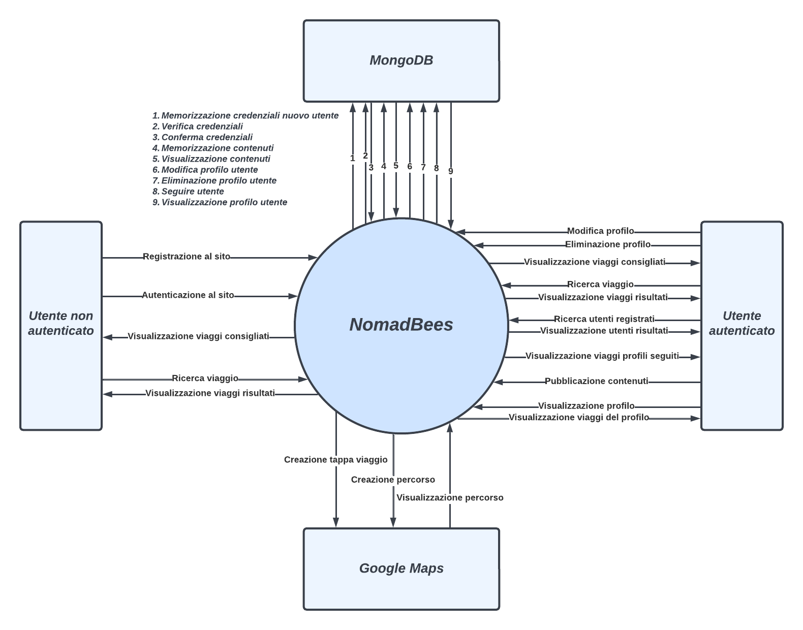

# Analisi del contesto
Nel presente capitolo viene discusso il contesto di funzionamento del sistema, fornendo una descrizione testuale ed una rappresentazione grafica basata su Context Diagram.

Nella seguente parte della sezione vengono presentati gli attori e i sistemi esterni con cui il sito "NomadBees" si interfaccerà.

## **Utenti e sistemi esterni**

**Utente non autenticato**

L'utente non autenticato è colui che naviga all'interno del sito senza ancora aver effettuato il login (o addirittura la registrazione).
All'utente non autenticato sono concesse delle funzionalità limitate, specificate nei RF 1, 10, 11.

**Utente autenticato**

L'utente autenticato è colui che, essendosi precedentemente registrato al sito, ha effettuato il login al sito con successo.
L'utente autenticato gode di tutte le funzionalità del sito, le quali sono specificate nei RF 3, 5, 6, 7, 8, 9, 10, 11, 12.

**Google Maps**

Il sistema interagisce con le API di Google Maps per soddisfare i RF
9, 11, 12

**MongoDB**

Il sistema interagisce con un database esterno, in particolare MongoDB, per poter memorizzare i dati ed i contenuti pubblicati da ciascun utente.
In particolare MongoDB sarà strettamente necessario per i RF 1, 2, 3, 4, 5, 6, 7, 8, 9, 10, 11, 12.

## **Diagramma di contesto**

Nel diagramma seguente vengono analizzati tutti i flussi di informazione tra il sistema "NomadBees" e le varie entità esterne.
Tra le entità esterne abbiamo 2 attori ("Utente non autenticato" e "Utente autenticato") e 2 sistemi subordinati ("Google Maps" e "MongoDB").

