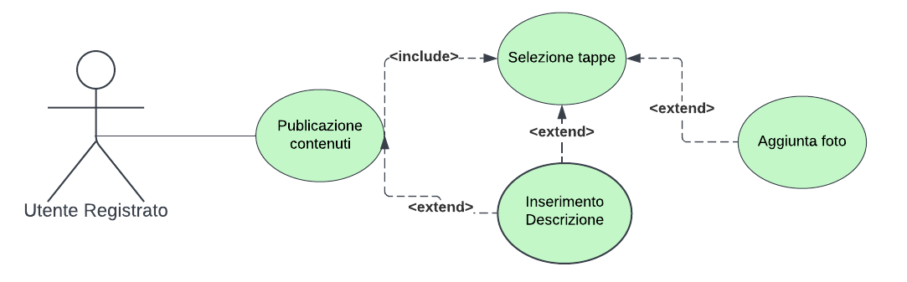
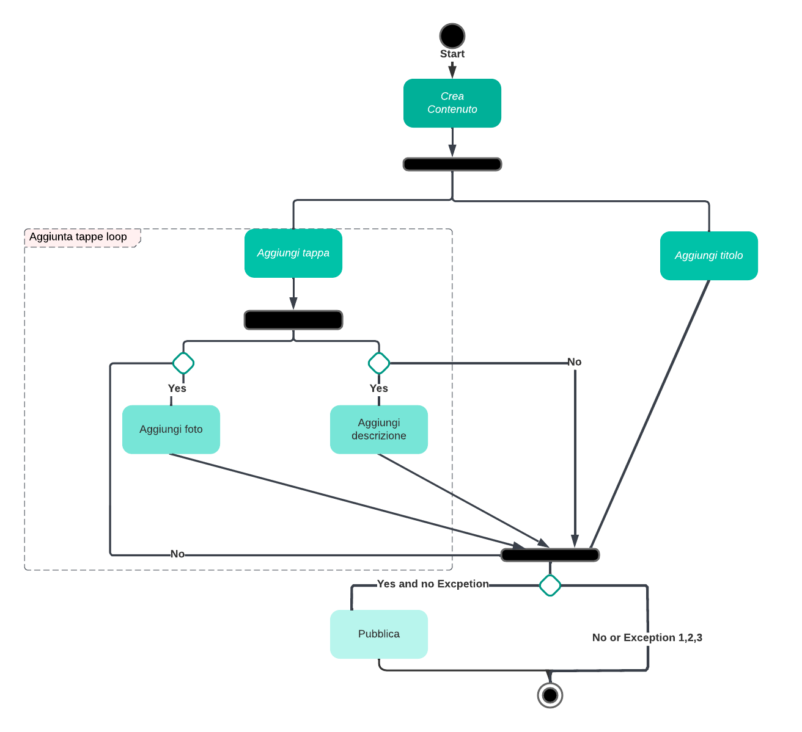
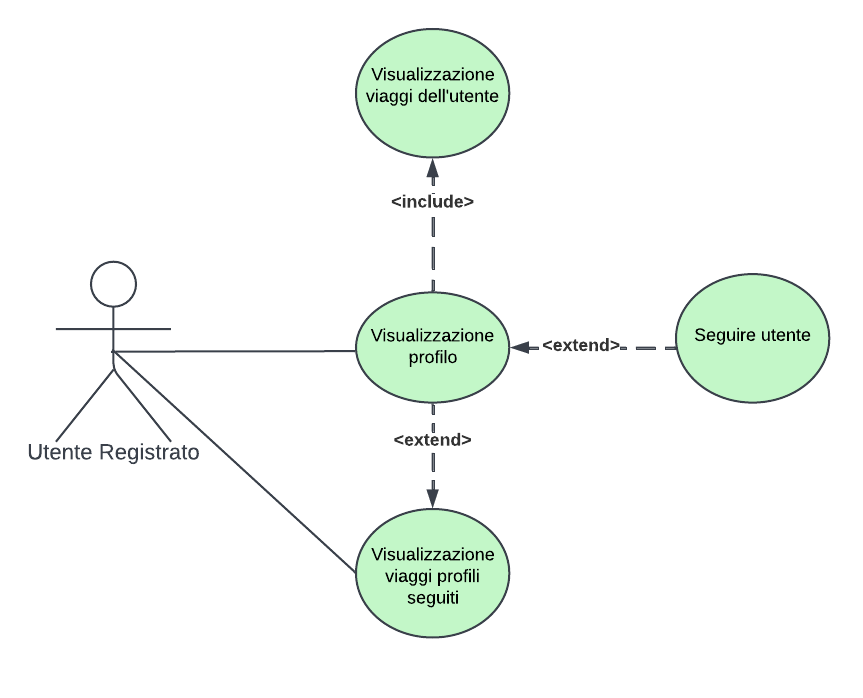
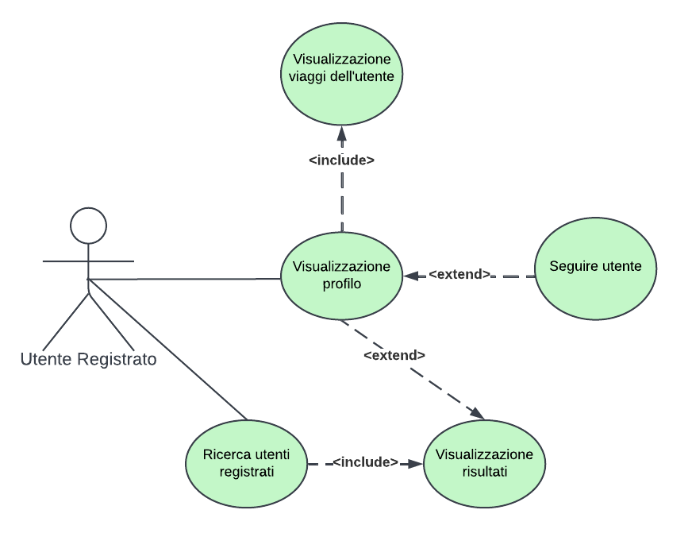
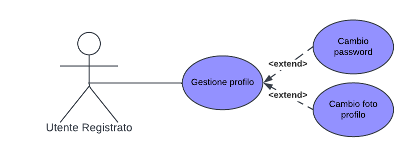
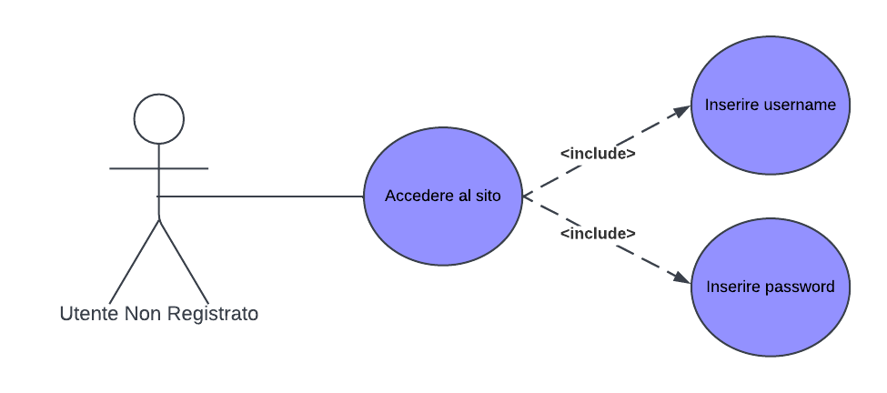

# Documento di specifica dei requisiti

### TODO: indice elementi

### TODO: scopo del documento

##  <ins> **Use Cases** </ins>

## **1. Visualizzazione Profilo**

**Titolo** 
Visualizzazione Profilo.

**Riassunto**
Questo use case descrive come avviene la visualizzazione del profilo di un altro utente.

**Descrizione**
1.	L’Utente può accedere alla funzione di visualizzazione profilo in diversi modi:
    1.	Mentre visualizza i viaggi ricercati (cfr….) cliccando sull’username del proprietario;
    2.	Mentre visualizza i viaggi consigliati (cfr…) cliccando sull’username del proprietario;
    3.	Mentre visualizza i viaggi dei profili seguiti (cfr…) cliccando sull’username del proprietario;
    4.	Quando cerca i profili  degli utenti registrati (cfr..) cliccando su uno degli username dei risultati.

2.	Una volta che l’utente ha selezionato il bottone per visualizzare il profilo il sito mostra la foto dell’utente selezionato, lo username ed i viaggi pubblicati. [EXTENSION 1].

**Extensions**
1.	Se il profilo visualizzato è un profilo seguito dall’utente, viene visualizzata anche questa informazione.

## **2. Pubblicazione contenuti**

**Titolo** 
Pubblicazione contenuti.

**Riassunto**
Questo use case descrive come avviene la pubblicazione di un contenuto da parte di un utente registrato.

**Descrizione**
1.	L’utente registrato accede alla pagina del sito chiamata “Crea”.

2.	Il sito mostra 4 Sezioni:
    1. Aggiunta titolo;
    2. Aggiunta descrizione generale;
    3. Selezione tappe;
    4. Mappa delle tappe.

3.	L’utente inserisce il nome del titolo del viaggio che sta creando [EXCEPTION 1].

4.	L’utente procede con la selezione delle tappe, in particolare [EXCEPTION 2]:
    1.	Sceglie la posizione (tramite API Google Maps), ciò comporta la creazione di una nuova tappa;
    2.	Aggiunge una foto (opzionale);
    3.	Aggiunge una descrizione (opzionale) [EXCEPTION 3].

5.	Terminata la creazione delle tappe l’utente conferma la creazione e pubblicazione del viaggio tramite apposito bottone.

**Exceptions**:
1.	Se il nome del titolo del viaggio supera i 80 caratteri viene visualizzato un messaggio d’errore e non è possibile pubblicare confermare la creazione del viaggio.
2.	Se l’utente seleziona meno di 2 tappe o più di 10 viene visualizzato un messaggio d’errore e non è possibile     pubblicare confermare la creazione del viaggio.
3.	Se il nome del titolo del viaggio supera i 1000 caratteri viene visualizzato un messaggio d’errore e non è possibile pubblicare confermare la creazione del viaggio.

## **3. Visualizzazione viaggi profili seguiti**

**Titolo**
Visualizzazione viaggi profili seguiti.

**Riassunto**
Questo use case descrive in che modo l’utente registrato visualizza i viaggi degli utenti che segue. 

**Descrizione**
1.	L’utente registrato accede alla pagina del sito “Seguiti”.
2.	Il sito mostra una preview [EXTENSION 1] dei 10 viaggi più recenti ricercati tra le pubblicazione amici.
3.	L’utente può ora effettuare 2 azioni:
I.	Visualizzare per intero uno o più viaggi presentati dal sito estendendo la preview;
II.	Visualizzare tutti i viaggi di un utente che segue [EXTENSION 2].

Extensions
1.	La preview comprende:
    a.	Titolo viaggio;
    b.	Nome utente che l’ha pubblicata;
    c.	Descrizione (se presente).
2.	Per visualizzare i viaggi di un utente nella parte superiore della pagina “Seguiti” ci sono le foto degli utenti seguiti, cliccandone una si accede alla funzione “Visualizzazione profilo” descritta nello Use case XXXXX.

## **4. Ricerca utenti registrati**

**Titolo**
Ricerca utenti registrati.

**Riassunto**
Questo use case descrive in che modo l’utente registrato può ricercare e visualizzare gli altri utenti registrati. 

**Descrizione**
1.	L’utente registrato accede alla pagina del sito “Seguiti”.
2.	Il sito mostra nella pagina una lista con le foto profilo degli utenti che segue ed una foto
con una “+”.
3.	L’utente clicca sulla “+”.
4.	Il sito mostra una tendina con una barra di ricerca.
5.	L’utente inserisce una stringa per ricercare l’username voluto e clicca sul tasto cerca.
6.	Il sito cerca e mostra gli username 5 utenti pertinenti [EXCEPTION 1].
7.	L’utente può visualizzare il profilo cliccando sull’username (CFR “Visualizzazione Profilo”).

**Exception**
1.	In caso la ricerca non producesse risultati pertinenti il sito mostra il seguente messaggio di errore: “Nessun risultato”.

## **5. Gestione Profilo**  //TODO: aggiungere cambio email, eliminazione profilo

**Titolo**
Gestione profilo.

**Riassunto**
Questo use case descrive la gestione del profilo di un utente registrato.

**Descrizione**
1.	L’utente ha la possibilità di cambiare la propria password. Ciò avviene:
    1. Inserendo la password attuale [EXCEPTION 1];
    2. Inserendo la nuova password desiderata [EXCEPTION 2];
    3. Inserendo una seconda volta la nuova password, in modo da verificarne la correttezza [EXCEPTION 3].
    
**Exceptions**
1.	Se la password inserita non corrisponde alla password attuale, verrà chiesto all’utente di riprovare inserendo la password corretta.
2.	Se la password scelta contiene meno di 6 e/o più di 12 caratteri, verrà chiesto di scegliere una nuova password.
3.	Se la password inserita non coincide con quella del punto 2, verrà comunicata la non coincidenza delle due password e verrà chiesto di riprovare.

## **6. Registrarsi al sito**  // TODO: aggiungere requisito email

**Titolo**
Registrarsi al sito.

**Riassunto**
Questo use case descrive la registrazione al sito da parte di un utente anonimo.

**Descrizione**
1.	L’utente sceglie uno username alfanumerico [EXCEPTION 1-2].
2.	L’utente sceglie una password alfanumerica [EXCEPTION 3].
    
**Exceptions**
1.	Se lo username scelto è già stato usato da un altro utente, verrà chiesto di scegliere uno nuovo username.
2.	Se lo username scelto contiene meno di 4 e/o più di 16 caratteri, verrà chiesto di scegliere uno nuovo username.
3.	Se la password scelta contiene meno di 6 e/o più di 12 caratteri, verrà chiesto di scegliere una nuova password.

## **7. Accedere al sito**

**Titolo**
Accedere al sito.

**Riassunto**
Questo use case descrive l’accesso al sito di un utente anonimo precedentemente registrato.

**Descrizione**
1.	L’utente inserisce il proprio username [EXCEPTION 1].
2.	L’utente inserisce la propria password [EXCEPTION 2].
    
**Exceptions**
1.	Se lo username inserito non appartiene ad alcun utente, verrà chiesto di riprovare inserendo uno username esistente.
2.	Se la password inserita non è corretta, verrà chiesto di riprovare inserendo una nuova password.

## **8. Creazione tappe viaggio**

**titolo**
Creazione tappe viaggio.

**Riassunto**
Questo use case descrive l'interazione con l'API Google Maps di JavaScript per selezionare le tappe del viaggio

**Descrizione**
1. L'utente inserisce il nome o l'indirizzo del luogo desiderato.
1. Con l'API Google Maps viene ricercato il luogo in input [EXCEPTION 1].
1. L'utente seleziona uno tra i possibili risultati.
1. Con l'API Google Maps vengono esportate le informazioni del luogo in un file JSON.

**Exceptions**
1. Se la ricerca non produce risultati, l'utente viene allertato

## **9. Visualizzazione percorso**

**titolo**
Visualizzazione percorso.

**Riassunto**
Questo use case descrive l'interazione con l'API Google Maps di JavaScript per visualizzare il percorso del viaggio all'interno di un post

**Descrizione**
1. Con l'API Google Maps vengono importate le tappe dai file JSON del viaggio.
1. Con l'API Google Maps viene generata una mappa che mostri il luogo in cui si svolge il viaggio.
1. Con l'API Google Maps vengono aggiunte una ad una le tappe alla mappa.
1. Man mano che vengono aggiunte le tappe, vengono disegnate delle linee che le uniscono e che indicano sommariamente l'itinerario

## **9. Ricerca viaggi**

**titolo**
Ricerca viaggi.

**Riassunto**
Questo use case descrive l'interazione con l'API Google Maps di JavaScript per selezionare le tappe del viaggio

**Descrizione**
1. All'utente viene presentata una barra di ricerca.
1. L'utente inserisce il titolo del viaggio desiderato o il luogo in cui si svolge.
1. L'utente seleziona da un menù a tendina la lunghezza del viaggio, da una serie di range di lunghezze predefiniti.
1. All'utente vengono mostrati i risultati della ricerca [EXCEPTION 1].

**Exception**
1.	In caso la ricerca non producesse risultati pertinenti il sito mostra il seguente messaggio di errore: “Nessun risultato”.

## **8. Visualizzazione viaggi consigliati**

**titolo**
Visualizzazione viaggi consigliati.

**Riassunto**
Questo use case descrive l'interazione con l'API Google Maps di JavaScript per selezionare le tappe del viaggio

**Descrizione**
1. L’utente accede alla pagina del sito chiamata "Luoghi".
1. Il sito mostra una preview [EXTENSION 1] di 10 viaggi selezionati casualmente dal database.
1. Selezionando uno di questi viene presentato l'intero viaggio nel dettaglio.

Extensions
1.	La preview comprende:
    a.	Titolo viaggio;
    b.  Fotografia;
    c.	Nome utente che l’ha pubblicata;
    d.	Descrizione (se presente).
